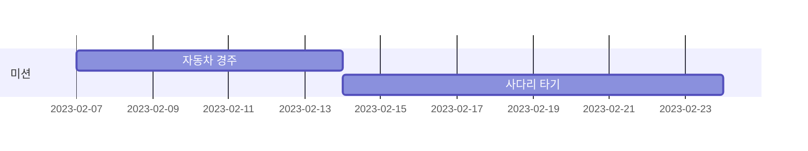

# 우아한 테크코스 과정 정리

### 🌿 백엔드 레벨 1

| Mission | Repository | PR1 | PR2 | 회고 |
| --- | --- | --- | --- | --- |
| 자동차 경주 | [java-racingcar](https://github.com/greeng00se/java-racingcar) | [1단계 - 자동차 경주 구현](https://github.com/woowacourse/java-racingcar/pull/510 ) | [2단계 - 자동차 경주 리팩터링](https://github.com/woowacourse/java-racingcar/pull/538) | [자동차 경주 회고](https://greeng00se.github.io/8/)|
| 사다리 타기 | [java-ladder](https://github.com/greeng00se/java-ladder) | [1단계 - 사다리 생성](https://github.com/woowacourse/java-ladder/pull/97) |  |  |
